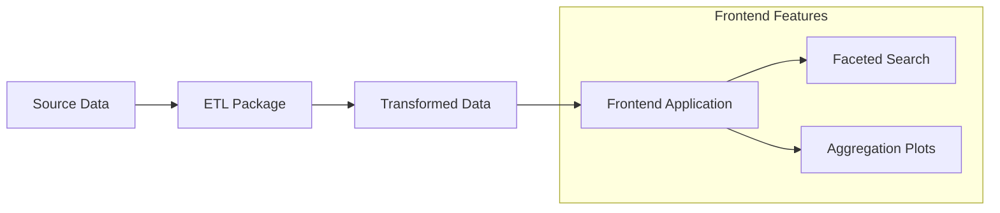

# AGE-C

Repository for the storage, transformation and presentation of data related to
the [AGE-C](https://age-c.eu/) project.

## Architecture

## ETL

The ETL package is a Python package that is used to transform the data from the
source data into the transformed data. For more information on how to use the
package, please refer to the [ETL README](etl/README.md).
