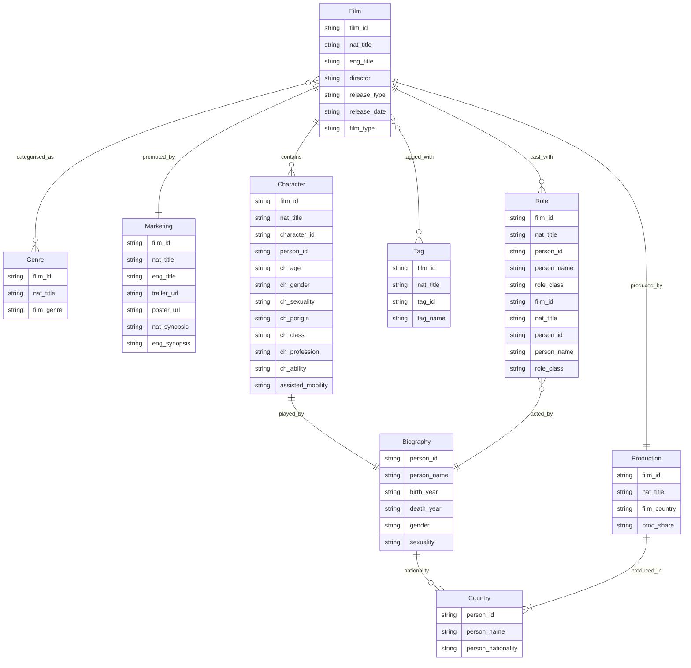
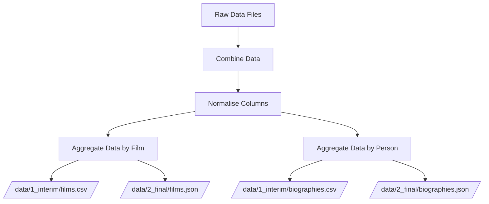

# ETL package for the AGE-C project

This package contains the code for the ETL pipeline for the AGE-C project. It is
used to extract the data from multiple CSV files and combine them into a single
JSON file suitable to be used by the
[itemsjs](https://github.com/itemsapi/itemsjs) search engine.

## Getting started

Install the [uv](https://docs.astral.sh/uv/getting-started/installation/)
package manager.

### Running the ETL process

```bash
uv run main.py
```

This will aggregate the data from the CSV files and save the results in two
formats, CSV and JSON. The CSV data is stored in the `data/1_interim` folder and
the JSON data is stored in the `data/2_final` folder.

The JSON data is then used by the frontend application to display and explore
the data.

## Data model



## Data processing pipeline

The following diagram shows the data processing pipeline for the AGE-C project.


