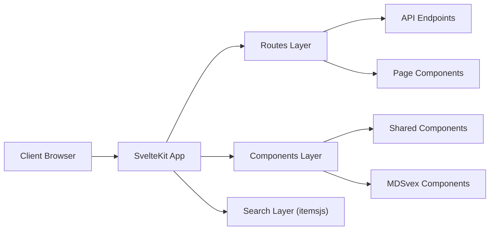

# Frontend application for the AGE-C project

This is the frontend application for the AGE-C project. It is a SvelteKit
application that uses [itemsjs](https://github.com/itemsapi/itemsjs) to search
and explore the data.

## Getting started

Install [bun](https://bun.sh/docs/installation) and run the following command
to install the dependencies:

```bash
bun install
```

After the dependencies are installed, run the following command to start the
development server:

```bash
bun run dev
```

By default, the application will be available at
[http://localhost:5173](http://localhost:5173).

## Building the application

To build the application, run the following command:

```bash
bun run build
```

This will build the application and save the files in the `build` folder.

## Architecture

The following diagram shows the architecture of the application.


