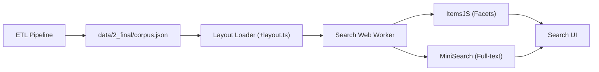
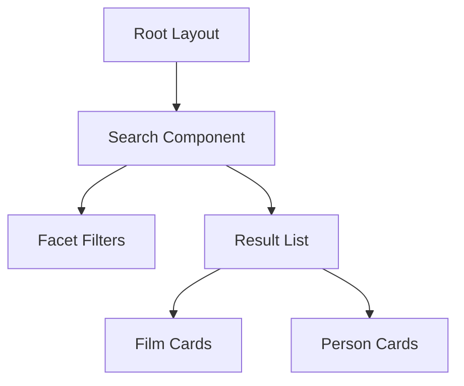

# Frontend Application for AGE-C

The AGE-C frontend is a SvelteKit application that provides faceted search and data visualization for film and biographical data. It consumes JSON data generated by the ETL pipeline and provides an interactive interface for exploring the corpus.

## Getting started

**Prerequisites:** Install [bun](https://bun.sh/docs/installation) or use [mise](https://mise.jdx.dev/) (`mise install`)

```bash
# Install dependencies
bun install

# Start development server (http://localhost:5173)
bun run dev

# Build for production
bun run build

# Preview production build
bun run preview
```

## Development Commands

```bash
# Testing
bun run test              # Run all tests (unit + e2e)
bun run test:unit         # Run unit tests with vitest
bun run test:e2e          # Run e2e tests with playwright

# Run specific test file
bun run test:unit src/lib/search/search.test.ts

# Code quality
bun run check             # Type checking with svelte-check
bun run lint              # Lint with biome
bun run format            # Format with biome
```

## Architecture

### Data Flow


```mermaid
flowchart LR
    ETL["ETL Pipeline"] --> JSON["data/2_final/corpus.json"]
    JSON --> Layout["Layout Loader (+layout.ts)"]
    Layout --> Worker["Search Web Worker"]
    Worker --> ItemsJS["ItemsJS (Facets)"]
    Worker --> MiniSearch["MiniSearch (Full-text)"]
    ItemsJS --> UI["Search UI"]
    MiniSearch --> UI
```

### Dual Search Engine Approach

The application uses two complementary search engines:

1. **itemsjs**: Handles faceted filtering and aggregations for structured data
2. **MiniSearch**: Provides fuzzy full-text search across all fields.

**Key files:**

- `src/lib/search/worker.ts`: Web Worker that runs search engines off the main thread
- `src/lib/search/search.ts`: Core search engine initialization and query execution
- `src/lib/search/config.ts`: Search configuration and facet definitions
- `src/lib/components/Search.svelte`: Main search UI component

### Routes & Pages

The application uses SvelteKit's file-based routing:

```
src/routes/
├── +layout.ts              # Loads corpus.json and initializes search
├── +page.svelte            # Home page with search interface
├── film/
│   └── [slug]/
│       └── +page.ts        # Loads individual film data
└── person/
    └── [slug]/
        └── +page.ts        # Loads individual person data
```

**Important patterns:**

- Uses `adapter-static` for prerendered static site generation
- `$data` alias points to `../data/2_final` (see `svelte.config.js`)
- Dynamic routes load individual JSON files from `films/{slug}.json` and `biographies/{slug}.json`
- Base path configured conditionally for GitHub Pages deployment

### Component Structure


```mermaid
flowchart TD
    Layout["Root Layout"] --> Search["Search Component"]
    Search --> Facets["Facet Filters"]
    Search --> Results["Result List"]
    Results --> FilmCard["Film Cards"]
    Results --> PersonCard["Person Cards"]
```

## Data Model

The frontend consumes JSON data with the following structure:

- **Films**: Title, release year, genre, production countries, directors, characters, awards
- **People**: Name, biography, nationality, birth/death years, filmography, characters portrayed
- **Cross-references**: Films reference people (directors, actors), people reference films (roles)

**Data sources:**

- `corpus.json`: Combined array of all films and people for search
- `films.json`: Complete films array
- `biographies.json`: Complete people array
- `films/{slug}.json`: Individual film details
- `biographies/{slug}.json`: Individual person details

All data files are located at `../data/2_final` (accessed via `$data` alias).

## Testing

### Unit Tests (Vitest)

Unit tests use Vitest with Testing Library for components and utilities.

**Test organization:**

- `*.svelte.test.ts`: Component tests (jsdom environment)
- `*.test.ts`: Server-side logic tests (node environment)

**Configuration:** See `vite.config.ts` with separate test projects for server and client code.

## Technology Stack

- **Framework**: SvelteKit with Svelte 5 (runes syntax)
- **Search**: itemsjs + MiniSearch in Web Worker
- **Testing**: Vitest (unit) + Playwright (e2e)
- **Styling**: Tailwind CSS (if configured)
- **Type Checking**: TypeScript with svelte-check
- **Code Quality**: Biome for linting and formatting
- **Package Manager**: Bun
- **Deployment**: GitHub Pages (static site)

## Performance Optimizations

- **Web Worker**: Search operations run in a separate thread to avoid blocking UI
- **Static Generation**: All pages prerendered at build time
- **Code Splitting**: Dynamic imports for route-specific code
- **Lazy Loading**: Individual film/person data loaded on demand

## Deployment

The application is deployed to GitHub Pages via GitHub Actions (`.github/workflows/ci.yml`).

**Build process:**

1. ETL pipeline generates JSON data
2. Frontend build process prerenders all routes
3. Static files deployed to `gh-pages` branch

**Environment-specific configuration:**

- Base path configured for GitHub Pages in production
- Data paths resolved via `$data` alias
